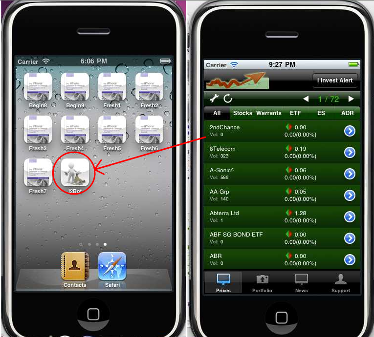

# ios-stock-tracker

Stock tracker implemented using Objective-C for iOS

# Features

The current system consists of:

1.       Iphone client program
2.       Crawling program for retrieving and processing data from financial sites and update the data at the remote server and database.
3.       Server php script and mysql database

The details of each applicaton that constitute the system are described below:

# Part 1. iOS App 

The iOS app downloads and displays data from remote server and database to the user. Its current graphical user interface (GUI) follows the design of the "SharedInvestor" iphone app. Figure 1 shows the screenshot of the "I2bot" on launch (app icon on the left side)

## Part 1.1 Price Tab
The prices tab shows prices for various categories, the default is "All", sub category includes "Stocks", "Warrants", "ETF", "ES", "ADR", figure 2 shows the table view under different category. The table view display 20 records at one page (adjustable), the total number of page is displayed at the top right hand corner (e.g. "1/72" means the page 1 out of 72 total pages). The page count is different under each category as different category has different total number of records. (e.g. "72" for the "All" category and "21" for the "Warrants" category).

In the table, each row can be expanded and collapsed by clicking on the table row, as illustrated in figure 4.

Clicking on the ">" next to each table row opens the detailed view of the particular record selected, as illustrated in figure 4.

At each page under a category, the table display 20 records, to navigate to the next or previous  20 records, user can "turn" the page by clicking on the ">" and "<" icons at the upper right corner, as illustrated in figure 5.

## Part 1.2 News Tab
The "News" tab on the tab bar brings out the "News" view, as illustrated in figure 6, many of the functionality in "News" view is similar to the "Price" in Part 1.1. To open the detailed view of the a news, simply click on the news, as illustrated in figure 6

# Part 2. Crawling Program.
While the iphone application is responsible for showing the data to the end user, at the back end, the crawling program is responsible for crawling and processing data from the financial sites. The crawling program is a desktop application that runs continuously, it retrieve data from the financial web site, then perform processing on the retrieved data, and finally uploads the data to the remote server and database. Multiple copies of the crawling program can be launched in multiple machines to retrieve and send data. Figure 8 illustrates the graphical user interface of the crawling program.

The crawling program allows the following configuration:

* Specify the frequency of data retrieving and uploading
* Specify the data packet size during uploading.
* Display the stats of crawling in terms of records retrieved and uploaded.
* Start and stop crawling

# Part 3 Server script and MySQL database.
The server side consists of php scripts that automatically build the datatable if none exists, update, retrieve and delete records in the MySQL database. Apart from generating JSON data,  It also presents simple html view on the "price" and "news" data as illustrated in figure 9 and 10 respectively.

